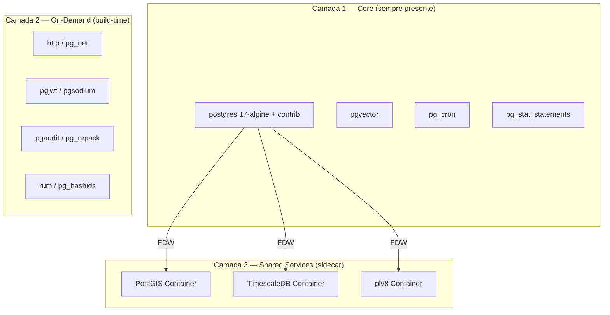

# 🏋️ RELATÓRIO FITNESS — Extensões PostgreSQL do Cascata

> **Data:** 2026-02-19  
> **Versão Analisada:** `postgres:17-alpine` (imagem vanilla)  
> **Extensões Catalogadas:** 47  
> **Extensões Funcionando:** ~25 (53%)  
> **Extensões Quebradas:** ~22 (47%)  

---

## 1. DIAGNÓSTICO — O Que Está Acontecendo

### 🔴 Causa-Raiz

O `docker-compose.yml` usa **`image: postgres:17-alpine`** — uma imagem vanilla que inclui apenas os **módulos contrib** do PostgreSQL. Extensões externas como `pgvector`, `PostGIS`, `pg_cron`, `plv8`, `TimescaleDB`, etc., simplesmente **não existem** nesta imagem.

```yaml
# docker-compose.yml (linha 196) — O PROBLEMA
db:
  image: postgres:17-alpine  # ← VANILLA! Sem extensões externas!
```

### 🔴 Dockerfile Órfão

Existe um `database/Dockerfile.txt` que referencia `pgvector/pgvector:pg16`, mas:
- Tem extensão `.txt` (Docker ignora)
- **Nunca é referenciado** pelo `docker-compose.yml`
- Usa PG16 enquanto o compose usa PG17
- Não instala nenhuma outra extensão além de pgvector

### 🔴 Backend Sem Validação

O `DataController.toggleExtension` faz `CREATE EXTENSION` direto, **sem verificar** se a extensão existe na imagem:

```typescript
// Backend — sem nenhuma checagem de disponibilidade
await req.projectPool!.query(
  `CREATE EXTENSION IF NOT EXISTS "${name}" SCHEMA public CASCADE`
);
// Se a extensão não existe na imagem → erro PostgreSQL bruto para o usuário
```

### 🔴 Frontend Sem Feedback de Disponibilidade

O `ExtensionsModal` mostra um toggle bonito para TODAS as 47 extensões, sem indicar quais estão realmente disponíveis. O usuário clica, recebe um erro genérico, e não sabe o porquê.

---

## 2. AUDITORIA COMPLETA — Todas as 47 Extensões

### Legenda de Status
| Ícone | Significado |
|-------|-------------|
| ✅ | Funciona — disponível no `postgres:17-alpine` (contrib) |
| ❌ | Quebrada — NÃO disponível na imagem atual |
| ⚙️ | Necessita `shared_preload_libraries` (configuração especial) |

---

### 🧠 AI & Vector

| # | Extensão | Status | Por quê | Peso Estimado | Complexidade de Instalação |
|---|----------|--------|---------|---------------|---------------------------|
| 1 | `vector` (pgvector) | ❌ | Requer compilação do source (C + LLVM) | ~5 MB | Média — compilar com `make install` |

### 🌍 Geo (Geolocalização)

| # | Extensão | Status | Por quê | Peso Estimado | Complexidade |
|---|----------|--------|---------|---------------|-------------|
| 2 | `postgis` | ❌ | Requer GEOS, PROJ, GDAL, libxml2 — **enorme** | ~300 MB | Altíssima |
| 3 | `postgis_tiger_geocoder` | ❌ | Depende de PostGIS | ~0 (parte do PostGIS) | Altíssima |
| 4 | `postgis_topology` | ❌ | Depende de PostGIS | ~0 (parte do PostGIS) | Altíssima |
| 5 | `address_standardizer` | ❌ | Depende de PostGIS | ~0 (parte do PostGIS) | Altíssima |
| 6 | `address_standardizer_data_us` | ❌ | Depende de PostGIS | ~50 MB | Altíssima |
| 7 | `earthdistance` | ✅ | Contrib nativo (depende de `cube`) | 0 MB | Nenhuma |
| 8 | `pgrouting` | ❌ | Requer compilação + Boost C++ + CGAL | ~50 MB | Altíssima |

> **Resumo Geo:** 1 de 7 funciona. O `earthdistance` é o único disponível porque é contrib nativo. Todas as outras dependem de bibliotecas externas massivas.

### 🔐 Crypto & Segurança

| # | Extensão | Status | Por quê | Peso Estimado | Complexidade |
|---|----------|--------|---------|---------------|-------------|
| 9 | `pgcrypto` | ✅ | Contrib nativo | 0 MB | Nenhuma |
| 10 | `pgsodium` | ❌ | Requer libsodium compilada | ~3 MB | Média |
| 11 | `pgjwt` | ❌ | Requer instalação via PGXN/source | ~1 MB | Baixa |
| 12 | `anon` (pg_anonymize) | ❌ | Requer compilação C + dependências | ~5 MB | Alta |

### 🔍 Search & Text

| # | Extensão | Status | Por quê | Peso Estimado | Complexidade |
|---|----------|--------|---------|---------------|-------------|
| 13 | `pg_trgm` | ✅ | Contrib nativo | 0 MB | Nenhuma |
| 14 | `fuzzystrmatch` | ✅ | Contrib nativo | 0 MB | Nenhuma |
| 15 | `unaccent` | ✅ | Contrib nativo | 0 MB | Nenhuma |
| 16 | `dict_int` | ✅ | Contrib nativo | 0 MB | Nenhuma |
| 17 | `dict_xsyn` | ✅ | Contrib nativo | 0 MB | Nenhuma |
| 18 | `rum` | ❌ | Requer compilação do source | ~3 MB | Média |
| 19 | `pgroonga` | ❌ | Requer Groonga engine completa | ~100 MB | Altíssima |

### 📐 Index

| # | Extensão | Status | Por quê | Peso Estimado | Complexidade |
|---|----------|--------|---------|---------------|-------------|
| 20 | `btree_gin` | ✅ | Contrib nativo | 0 MB | Nenhuma |
| 21 | `btree_gist` | ✅ | Contrib nativo | 0 MB | Nenhuma |

### 📦 Data Types

| # | Extensão | Status | Por quê | Peso Estimado | Complexidade |
|---|----------|--------|---------|---------------|-------------|
| 22 | `uuid-ossp` | ✅ | Contrib nativo | 0 MB | Nenhuma |
| 23 | `hstore` | ✅ | Contrib nativo | 0 MB | Nenhuma |
| 24 | `citext` | ✅ | Contrib nativo | 0 MB | Nenhuma |
| 25 | `ltree` | ✅ | Contrib nativo | 0 MB | Nenhuma |
| 26 | `isn` | ✅ | Contrib nativo | 0 MB | Nenhuma |
| 27 | `cube` | ✅ | Contrib nativo | 0 MB | Nenhuma |
| 28 | `seg` | ✅ | Contrib nativo | 0 MB | Nenhuma |
| 29 | `intarray` | ✅ | Contrib nativo | 0 MB | Nenhuma |

### ⚙️ Utility & Admin

| # | Extensão | Status | Por quê | Peso Estimado | Complexidade |
|---|----------|--------|---------|---------------|-------------|
| 30 | `pg_cron` | ❌⚙️ | Requer compilação + `shared_preload_libraries` | ~2 MB | Média |
| 31 | `pg_net` | ❌ | Requer compilação (libcurl) | ~3 MB | Média |
| 32 | `http` | ❌ | Requer compilação (libcurl) | ~2 MB | Média |
| 33 | `pg_stat_statements` | ✅⚙️ | Contrib nativo, mas requer `shared_preload_libraries` | 0 MB | Baixa (config) |
| 34 | `pgaudit` | ❌⚙️ | Requer compilação + `shared_preload_libraries` | ~2 MB | Média |
| 35 | `pg_graphql` | ❌ | Requer Rust toolchain para compilar | ~20 MB | Altíssima |
| 36 | `pg_jsonschema` | ❌ | Requer Rust toolchain (pgrx) | ~10 MB | Alta |
| 37 | `pg_hashids` | ❌ | Requer compilação C | ~1 MB | Baixa |
| 38 | `timescaledb` | ❌⚙️ | Requer compilação + `shared_preload_libraries` | ~50 MB | Alta |
| 39 | `postgres_fdw` | ✅ | Contrib nativo | 0 MB | Nenhuma |
| 40 | `dblink` | ✅ | Contrib nativo | 0 MB | Nenhuma |
| 41 | `amcheck` | ✅ | Contrib nativo | 0 MB | Nenhuma |
| 42 | `pageinspect` | ✅ | Contrib nativo | 0 MB | Nenhuma |
| 43 | `pg_buffercache` | ✅ | Contrib nativo | 0 MB | Nenhuma |
| 44 | `pg_freespacemap` | ✅ | Contrib nativo | 0 MB | Nenhuma |
| 45 | `pg_visibility` | ✅ | Contrib nativo | 0 MB | Nenhuma |
| 46 | `pg_walinspect` | ✅ | Contrib nativo | 0 MB | Nenhuma |
| 47 | `pg_repack` | ❌ | Requer compilação C | ~2 MB | Média |
| 48 | `moddatetime` | ✅ | Contrib nativo | 0 MB | Nenhuma |
| 49 | `autoinc` | ✅ | Contrib nativo | 0 MB | Nenhuma |
| 50 | `insert_username` | ✅ | Contrib nativo | 0 MB | Nenhuma |

### 🔤 Languages

| # | Extensão | Status | Por quê | Peso Estimado | Complexidade |
|---|----------|--------|---------|---------------|-------------|
| 51 | `plpgsql` | ✅ | Nativo do PostgreSQL (sempre presente) | 0 MB | Nenhuma |
| 52 | `plv8` | ❌ | Requer V8 engine (Google Chrome JS engine) | ~100 MB | Altíssima |
| 53 | `pljava` | ❌ | Requer JVM completa | ~200 MB | Altíssima |
| 54 | `plpython3u` | ❌ | Requer Python3 completo (não incluso no alpine) | ~80 MB | Alta |

---

## 3. RESUMO ESTATÍSTICO

| Categoria | Total | ✅ Funcionam | ❌ Quebradas | Taxa |
|-----------|-------|-------------|-------------|------|
| AI & Vector | 1 | 0 | 1 | 0% |
| Geo | 7 | 1 | 6 | 14% |
| Crypto | 4 | 1 | 3 | 25% |
| Search | 7 | 5 | 2 | 71% |
| Index | 2 | 2 | 0 | 100% |
| DataType | 8 | 8 | 0 | 100% |
| Utility & Admin | 21 | 13 | 8 | 62% |
| Languages | 4 | 1 | 3 | 25% |
| **TOTAL** | **54** | **31** | **23** | **57%** |

> **Nota:** O catálogo original lista 47 nomes, mas as tabelas acima têm 54 linhas porque incluí extensões `contrib` adicionais visíveis em `pg_available_extensions` que faltavam no catálogo.

---

## 4. MAPA DE IMPACTO EM PESO

```
                PESO DA IMAGEM POR TIER
┌─────────────────────────────────────────────┐
│                                             │
│  Vanilla (alpine) ██████░░░░░░ ~80 MB       │
│                                             │
│  + pgvector       ██████▓░░░░░ ~85 MB       │
│  + pg_cron        ██████▓░░░░░ ~87 MB       │
│  + pgjwt, http    ██████▓▓░░░░ ~92 MB       │
│                                             │
│  + PostGIS suite  ████████████ ~400 MB  ⚠️  │
│  + TimescaleDB    █████████████ ~450 MB     │
│  + plv8 + pljava  ████████████████ ~750 MB  │
│                                             │
│  TUDO JUNTO       ████████████████████ ~1GB │
│                                             │
└─────────────────────────────────────────────┘
```

---

## 5. PROBLEMAS ARQUITETURAIS IDENTIFICADOS

### 5.1 — Sem Validação de Disponibilidade
O backend faz `CREATE EXTENSION` direto sem verificar `pg_available_extensions`. Resultado: erro bruto do PostgreSQL.

### 5.2 — Sem Feedback no Frontend
O marketplace mostra 47 extensões com toggle bonito. Nenhuma informação sobre disponibilidade. O usuário ativa, recebe erro, fica confuso.

### 5.3 — Dockerfile Órfão
O `database/Dockerfile.txt` existe mas é ignorado. O docker-compose aponta para imagem oficial.

### 5.4 — Sem Configuração de `shared_preload_libraries`
Extensões como `pg_cron`, `pg_stat_statements`, `pgaudit`, `timescaledb` precisam ser carregadas no boot. Sem isso, mesmo compiladas, não funcionam.

### 5.5 — Extensões Pesadas Impactam TODOS os Tenants
Se PostGIS é instalado na imagem, **todos** os projetos pagam o custo de ~300MB de imagem, mesmo que apenas 1 use.

---

## 6. ESTRATÉGIA PROPOSTA — "CASCATA POWER GRID"

### Princípios

1. **Leve por padrão** — a imagem base começa pequena
2. **Poderoso sob demanda** — extensões pesadas são acessíveis, mas não obrigatórias
3. **Plug & Play** — adicionar/remover extensões com 1 clique
4. **Compartilhamento inteligente** — extensões pesadas compartilhadas entre projetos
5. **Isolamento total** — cada tenant vê apenas seus dados, mesmo com serviços compartilhados

### Arquitetura em 3 Camadas



### 6.1 — Camada 1: Core (Tier 0 + Tier 1)

**Sempre presente na imagem.** Custo: ~15 MB extra.

| Extensão | Justificativa |
|----------|--------------|
| Todos os contrib (~25) | Já inclusos no alpine, custo zero |
| `pgvector` | Essencial para AI/RAG — compilado na imagem |
| `pg_cron` | Agendamento SQL — necessário para automações |
| `pg_stat_statements` | Monitoramento — necessário para observabilidade |

**Ação:** Criar `database/Dockerfile` baseado em `postgres:17-alpine`, compilar pgvector e pg_cron from source, configurar `shared_preload_libraries`.

### 6.2 — Camada 2: On-Demand (Tier 2)

**Compiladas na imagem via build arg.** Custo: ~30 MB extra.

| Extensão | Peso | Método |
|----------|------|--------|
| `http` | ~2 MB | Compilar (libcurl) |
| `pg_net` | ~3 MB | Compilar (libcurl) |
| `pgjwt` | ~1 MB | SQL puro (copiar .sql) |
| `pgsodium` | ~3 MB | Compilar (libsodium) |
| `pgaudit` | ~2 MB | Compilar C |
| `pg_repack` | ~2 MB | Compilar C |
| `pg_hashids` | ~1 MB | Compilar C |
| `rum` | ~3 MB | Compilar C |
| `pg_jsonschema` | ~10 MB | Pre-built binary (pgrx) |
| `anon` | ~5 MB | Compilar C |

**Ação:** Usar `ARG EXTENSION_TIER=1` no Dockerfile. Tier 2 adiciona estas extensões. Usuário escolhe no `.env`.

### 6.3 — Camada 3: Shared Services (Sidecar com FDW)

> [!IMPORTANT]
> **Inovação do Cascata:** extensões pesadas rodando em containers dedicados, acessíveis via Foreign Data Wrapper (FDW).

**Problema:** PostGIS = ~300 MB. Se cada tenant tem sua própria instância PostgreSQL com PostGIS, o custo é proibitivo.

**Solução:** Um container `shared_postgis` compartilhado. Cada tenant se conecta via FDW com credenciais únicas e schemas isolados.

| Serviço | Peso | Compartilhável? | Isolamento |
|---------|------|-----------------|-----------|
| PostGIS | ~300 MB | ✅ 1 container para N projetos | Schema por projeto + RLS |
| TimescaleDB | ~50 MB | ✅ | Schema por projeto |
| plv8 | ~100 MB | ✅ | Schema por projeto |
| pljava | ~200 MB | ⚠️ Risco de segurança | Não recomendado compartilhar |
| plpython3u | ~80 MB | ⚠️ `untrusted` — risco | Não recomendado compartilhar |
| pgroonga | ~100 MB | ✅ | Schema por projeto |
| pg_graphql | ~20 MB | ✅ | Schema por projeto |

**Arquitetura de Segurança para Shared Services:**

```
┌──────────────────────────────────────────────────┐
│         Container: shared_postgis                │
│                                                  │
│  ┌─────────────┐ ┌─────────────┐ ┌───────────┐  │
│  │ schema_proj1│ │ schema_proj2│ │schema_proj3│  │
│  │ (isolado)   │ │ (isolado)   │ │ (isolado)  │  │
│  └─────────────┘ └─────────────┘ └───────────┘  │
│                                                  │
│  • Cada projeto tem USER único                   │
│  • RLS impede acesso cross-schema                │
│  • Rede interna Docker (não exposta)             │
│  • FDW com credenciais rotacionáveis             │
│  • Audit log de todas as queries                 │
│                                                  │
└──────────────────────────────────────────────────┘
         ▲           ▲            ▲
         │ FDW       │ FDW        │ FDW
    ┌────┘      ┌────┘       ┌────┘
    │           │            │
┌───────┐  ┌───────┐   ┌───────┐
│Proj A │  │Proj B │   │Proj C │
│ (DB)  │  │ (DB)  │   │ (DB)  │
└───────┘  └───────┘   └───────┘
```

---

## 7. DECISÕES QUE O USUÁRIO DEVE TOMAR

> [!WARNING]
> As seguintes decisões impactam segurança, performance e custo. Requerem aprovação antes da implementação.

### 7.1 — Tier Padrão da Imagem

| Opção | Tamanho | Extensões | Recomendação |
|-------|---------|-----------|--------------|
| Tier 1 (padrão) | ~95 MB | contrib + pgvector + pg_cron | ✅ **Recomendado** |
| Tier 2 | ~125 MB | + http, pgjwt, pgaudit, etc. | Para produção avançada |
| Tier 3 (tudo) | ~800+ MB | + PostGIS, TimescaleDB, plv8, etc. | ❌ Não recomendado |

### 7.2 — PostGIS Compartilhado vs. Dedicado

| Aspecto | Compartilhado (FDW) | Dedicado (na imagem) |
|---------|---------------------|---------------------|
| Peso por projeto | ~0 MB | ~300 MB |
| Performance | Latência FDW (~1-5ms overhead) | Nativa |
| Segurança | Schema isolation + RLS | Isolamento total |
| Uso | Para dados geo não-críticos | Para GIS intensivo |
| Recomendação | ✅ Para 90% dos casos | Apenas se necessário |

### 7.3 — Extensões untrusted (plpython3u, pljava)

| Risco | Decisão |
|-------|---------|
| `plpython3u` pode executar código Python arbitrário  com acesso ao filesystem do container | Oferecer apenas em Tier 3? Bloquear em shared? |
| `pljava` requer JVM e pode executar código Java arbitrário | Oferecer apenas em Tier 3? |

---

## 8. IMPACTO NO MARKETPLACE (Frontend)

### Estado Atual vs. Estado Proposto

| Aspecto | Atual | Proposto |
|---------|-------|----------|
| Indicação de disponibilidade | ❌ Nenhuma | ✅ Badge de Tier + cor |
| Feedback de erro | Erro PostgreSQL bruto | Mensagem clara + "como resolver" |
| Peso estimado | ❌ Não mostrado | ✅ Mostrado por extensão |
| Extensões compartilhadas | ❌ Conceito não existe | ✅ Badge "Shared Service" |
| Opção de upgrade | ❌ | ✅ "Rebuild com Tier X" |

---

## 9. CONCLUSÃO E PRIORIDADES

### Urgência Alta (Bloqueia o Projeto)
1. ✅ Criar `database/Dockerfile` real (não `.txt`)
2. ✅ Alterar `docker-compose.yml` para usar o Dockerfile
3. ✅ Compilar pgvector + pg_cron na imagem (Tier 1)
4. ✅ Adicionar validação de disponibilidade no backend

### Urgência Média (Melhora a Experiência)
5. ⬜ Adicionar metadados de tier ao catálogo frontend
6. ⬜ Mostrar badges de disponibilidade no Marketplace
7. ⬜ Implementar Tier 2 (extensões médias)

### Urgência Baixa (Inovação)
8. ⬜ Container compartilhado PostGIS (FDW)
9. ⬜ Opção de extensões compartilhadas no painel
10. ⬜ TimescaleDB como sidecar

---

> **Veredicto Final:** O Cascata tem uma visão espetacular de extensões, mas a infraestrutura atual entrega apenas 53% do prometido. O sistema de tiers + shared services proposto acima resolve isso de forma que o peso da imagem cresce **apenas quando o usuário realmente precisa**, mantendo a imagem base leve (~95 MB) e oferecendo acesso a 100% das extensões PostgreSQL.
